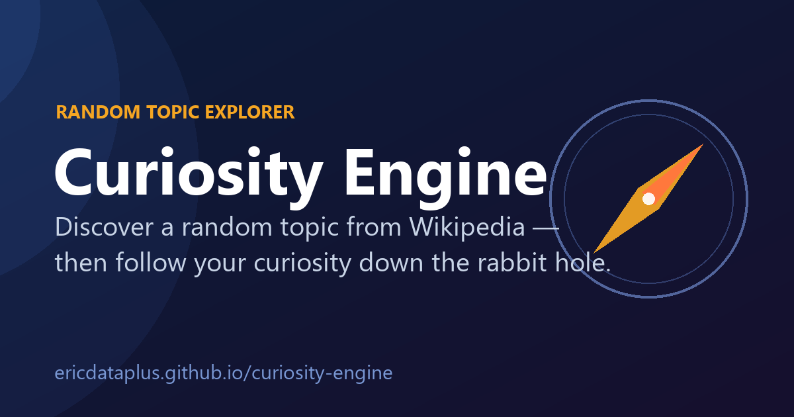

# Curiosity Engine

### 🔗 [**Live site → ericdataplus.github.io/curiosity-engine**](https://ericdataplus.github.io/curiosity-engine/)

*One click surfaces a fascinating random topic from Wikipedia — then you follow your curiosity down the rabbit hole. Runs entirely in your browser, no install, no account.*



A small but feature-rich static web app. Click **Discover** to pull a random topic from a
curated set of **1,200+ subjects across 24 fields** (science, history, art, philosophy, music,
tech, and more), read a clean Wikipedia summary, then keep pulling the thread through related
topics. No backend, no build step, no API keys.

## Features

- **Discover** — one click pulls a random topic from **1,200+ curated subjects across 24 categories**
- **Rabbit-hole trails** — follow *related* topics and the app builds a clickable breadcrumb
  ("Black hole › Event horizon › Hawking radiation") you can share via a `?path=` link
- **Back/forward navigation** — every topic is a real URL, so the browser Back button walks your trail
- **Topic of the Day** — one deterministic daily pick everyone gets (great to share)
- **Daily streak** — a flame counter that rewards coming back
- **Reading list** — bookmark topics, mark them read/unread, and watch a progress bar fill up
- **Notes** — jot down *why* a topic caught your eye; notes persist per topic
- **Listen** — read any article aloud with the browser's speech synthesis
- **Simpler** — toggle to the Simple English version of an article
- **Topic videos** — relevance-filtered video results, plus a one-tap "Watch on YouTube"
- **Shareable deep links** — copy a link to any topic (uses the native share sheet on mobile)
- **Light / dark theme** — follows your OS preference, and remembers your override
- **Fast & resilient** — prefetches the next topic for instant swaps, auto-retries on hiccups,
  and works great on phone, tablet, and desktop

## Running locally

The app fetches `topics.csv` and the Wikipedia API, so it must be served over HTTP
(opening `index.html` via `file://` falls back to a tiny built-in topic list).

```bash
# from the project directory
python -m http.server 8000
# then open http://localhost:8000
```

Or deploy the folder as-is to any static host (GitHub Pages, Netlify, Cloudflare Pages, etc.).

## How it works

- Topics live in `topics.csv` (`category,topic,tier`). `tier` is `mainstream` or `deepcut`;
  the Topic of the Day favors mainstream picks.
- `script.js` picks a random, not-recently-seen topic, fetches its summary from
  `https://en.wikipedia.org/api/rest_v1/page/summary/<title>`, and renders it.
- Related topics come from Wikipedia's `morelike:` search; videos from the keyless Dailymotion API.
- Bookmarks, notes, history, trail, streak, and theme are all persisted in `localStorage` —
  there is no server and nothing leaves your browser.

## Tech

- HTML5, CSS3, vanilla JavaScript (ES6+) — no framework, no build step
- Wikipedia REST + `morelike` search APIs
- Dailymotion open API (keyless) for topic videos
- Font Awesome icons

## License

This project is open source and available under the [MIT License](LICENSE).

## Acknowledgements

- Wikipedia for providing free access to their content
- Dailymotion & YouTube for video discovery
- Font Awesome for the icons
